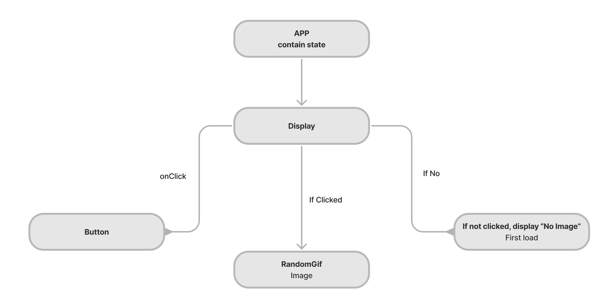

Nice job adding the component diagram! I would probably use a different shape for items that are not components as you have App, Button, and Display 
getRandomGif and gif are props/state 

**Giphy React App**
##Here I will render a page with no iamge and when the App sees the button click. The app will render a random Gif

*Component Heirarchy*
